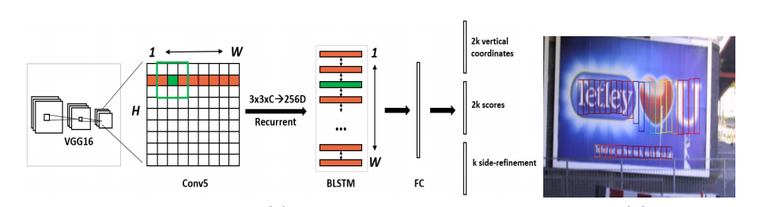

# Text-Detection in natural Scenes-using-CNN

This model is inspired from the paper https://arxiv.org/pdf/1609.03605.pdf.


The entire algorithm flow mainly in the following steps:
- VGG16 as the base net to extract the feature, the feature of conv5_3 is obtained as feature map, the size is W × H × C.
Then in this feature map to do sliding window, the window size is 3 × 3. That is, each window can get a length of 3 × 3 × C eigenvectors.
- The characteristics obtained in the previous step are input to a bi-directional LSTM to obtain an output of length W × 256, and then a fully connected layer of 512 is prepared for output.
- The output layer part has three main outputs. 2k vertical coordinates, because an anchor with the center of the high (y coordinate) and the height of the rectangular box, said two values, so a 2k output. (Note here is the relative offset of the anchor). 2k scores, because there are k text proposals predicted, so there are 2k scores, text and non-text each have a score. k side-refinement, this part is mainly used to refine the two endpoints of the text line, which means that the amount of horizontal translation for each proposal.
- This is a text proposal that gets intensive predictions, so a standard non-maximal suppression algorithm is used to filter out redundant boxes.
- Finally, we use the graph-based text line construction algorithm to merge the obtained text segments into text lines.



I trained the model on COCO-text Dataset containing 63,686 images and MSRA-TD500 dataset on Xeon Clusters to which i got access as being Student ambassador of Intel nervana academy.

To test the model put your images in data/demo, the results will be saved in data/results, and run demo in the root
```shell
python ./ctpn/demo.py
```
# roadmap
 - Resnet architecture to improve accruacy
 - Understanding the text
 - Trying various hyperparameters for the anchor size to improve accuracy
# Results


